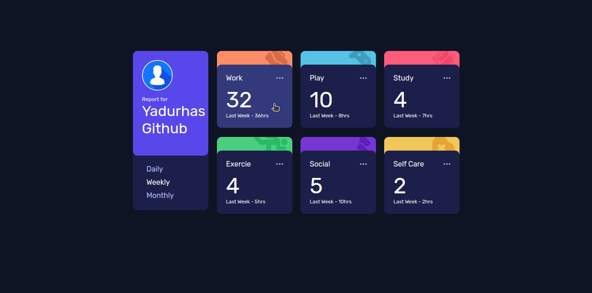
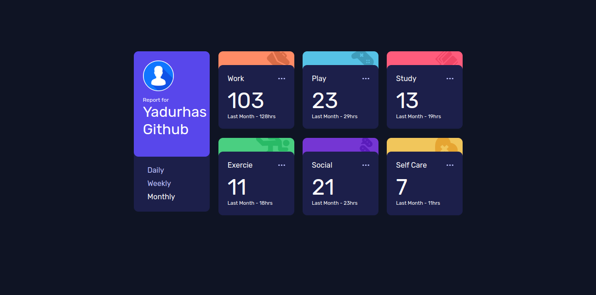

# Frontend Mentor - Time tracking dashboard solution

This is a solution to the [Time tracking dashboard challenge on Frontend Mentor](https://www.frontendmentor.io/challenges/time-tracking-dashboard-UIQ7167Jw). Frontend Mentor challenges help you improve your coding skills by building realistic projects. 

## Table of contents

- [Overview](#overview)
  - [The challenge](#the-challenge)
  - [Screenshot](#screenshot)
  - [Links](#links)
  - [Built with](#built-with)
  - [My Learnings](#my-learnings)
  - [Continued development](#continued-development)
- [Author](#author)

**Note: Delete this note and update the table of contents based on what sections you keep.**

## Overview

### The challenge

Users should be able to:

- View the optimal layout for the site depending on their device's screen size
- See hover states for all interactive elements on the page
- Switch between viewing Daily, Weekly, and Monthly stats

### Screenshot

### Links

### Built with

- Semantic HTML5 markup
- CSS custom properties
- Flexbox
- ES6 JS

### My Learnings

- using z-indexes,
- seperating of concerns in the sense that not using javascript to change CSS properties, instead choosing to change classes,
- using relative sizes to size fonts,
- using dev tools in the browser to better calculate the size of divs,
- dealing with JSON data

Use this section to recap over some of your major learnings while working through this project. Writing these out and providing code samples of areas you want to highlight is a great way to reinforce your own knowledge.

### Continued development

Need to include responsive design to the site

## Author

- Website - [Yadurhas]([https://www.your-site.com](https://github.com/yadurhas))
